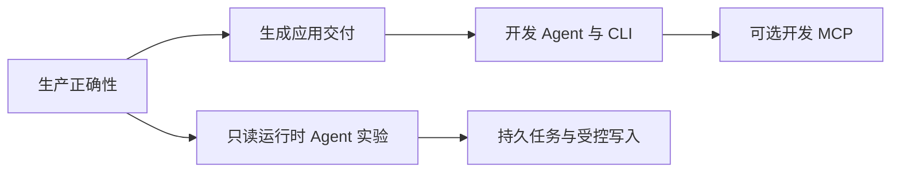

# Gin-Bear 成熟度升级与 AI Agent 分阶段开发总计划

日期：2026-09-19。状态：设计完成，尚未实施。本文是生产修复、脚手架成熟度与 AI Agent 建设的唯一执行与验收文档。用户确认：开发辅助 Agent 与应用运行时 Agent 两者都考虑，分阶段实施。

## 1. 任务背景与边界

审查 HEAD 为 `e7959cc`，用户指定对比提交为 `5498c9388a43c28e72a78601e8d925af3a2fa3e9`。本地正式 `v0.9.3` 标签实际指向 `a2a6d7ded50fec0acdc5e070921930493f8a017f`，不能把这两个基线混称。

第一阶段 M0 先修复三个已复现问题；后续阶段见第 10—15 节，不混入同一个修复 PR：

| 编号 | 优先级 | 已观察到的行为 | 成功标准 |
| --- | --- | --- | --- |
| A | P1 | Casbin 删除角色成功后，已有允许结果仍命中缓存；显式清缓存后才拒绝 | 默认构造的旧接口顺序撤权立即生效；新增受控接口支持安全的并发鉴权与策略变更 |
| B | P1 | HTTP 请求已取消，经 `*gin.Context` 传入 Repository 的查询仍成功 | Repository 保留事务，并把请求取消、截止时间和原生 context 值传到 GORM |
| C | P2 | `BEAR_ENV=prod` 时运行时选择 PostgreSQL，生成器仍读取基础配置并输出 MySQL DDL | 生成和运行使用相同配置选择、覆盖规则；生成阶段不要求连接数据库或取得生产密钥 |

A、B 是既有缺陷；C 来自新增迁移生成流程。不要借机更换 ORM、重写认证、修改所有生成模板或升级依赖。

上轮 `go test ./... -count=1` 全通过，主测试工具链为 Go 1.26.4，部分生成项目测试固定 Go 1.25.14。三个问题由仓库外独立程序复现，不代表仓库已添加回归测试。尚未完成本轮修复的任何验证，也没有真实 MySQL/PostgreSQL、多实例生产验收证据。

执行前重新检查实际 HEAD、工作区和本地 `AGENTS.md`、`agent.md`。当前已有用户授权的 `.gitignore` 修改：忽略 `agent.md`；不要撤销或混入业务修复提交。两个 Agent 文件均为本地文件，不得提交。

## 2. M0 实施顺序与工作分配

顺序为 A1 → B → C → A2 → 集成验收。每项先添加失败测试并记录 RED，再修改实现并记录 GREEN。A2 是动态权限生产路径的必要交付，不可只完成 A1 就声称并发撤权已安全。

| 工作 | 建议模型能力 | 文件责任 |
| --- | --- | --- |
| A1/A2 权限语义、并发与故障处理 | 高能力模型，如可用的 gpt-6-astra | `pkg/bear/casbin.go`、新增 Casbin authorizer 与测试 |
| B 请求上下文和事务修复 | 高能力模型 | `pkg/bear/db.go`、对应回归测试 |
| C 配置和迁移生成 | 通用开发模型，如 gpt-5.6-sol/terra；高能力模型复核配置边界 | `pkg/bear/config_loader.go`、`internal/cli`、生成集成测试 |
| 文档、定向测试整理 | 轻量模型，如 gpt-5.6-luna | 文档和测试记录，不独立改变安全设计 |

模型是能力建议，执行工具没有这些模型时使用对应能力等级，不声称已切换。默认串行；如果执行者另行启用多代理，应明确文件所有权、不得覆盖彼此修改，重型 Go 构建串行，只有主执行者提交。这里不要求为三个问题强行并行。

## 3. A：权限缓存与动态撤权

### 3.1 根因及不能采用的修法

`pkg/bear/casbin.go` 的 `CasbinEnforcer` 公开嵌入 `*casbin.CachedEnforcer`。当前使用的 Casbin v2.110.0 并没有为所有角色、命名策略、过滤删除等操作完整清理决策缓存；框架也没有设置决策 TTL。

只重写 `RemoveGroupingPolicy` 并清缓存不完整：用户还可调用其他提升方法或公开的底层指针。先计算、后写缓存与清缓存之间也可能发生交错。单独增加 TTL 只能缩短过期授权时间，不能满足立即撤权。换成 `SyncedCachedEnforcer` 也不能据此认定缓存失效已完整解决。

### 3.2 A1：旧接口的最小兼容修复

修改 `NewCasbinEnforcer`，在构造成功、返回对象前执行 `EnableCache(false)`，默认不使用决策缓存。保留现有 `CasbinEnforcer` 的公开嵌入字段、类型、构造签名及提升方法，不为此修改 v0.9.1 API 基线。

更新缓存相关注释和生产文档：默认缓存关闭；旧接口仍不保证“请求鉴权与策略写入并发执行”安全。调用者显式重新开启缓存属于自定义行为，不在默认撤权保证内。手工构造 `CasbinEnforcer{CachedEnforcer: ...}` 也不自动取得工厂的默认保证。

新增 `pkg/bear/casbin_revocation_test.go`，至少覆盖：

1. 赋予 `alice -> admin` 和管理员 GET 权限，先得到允许；删除角色后下一次鉴权拒绝，无显式清缓存。
2. 先鉴权得到拒绝，再赋予角色，下一次允许，覆盖负缓存。
3. 删除角色所拥有的策略后用户拒绝，覆盖“用户请求键与角色策略键不同”。
4. 命名或过滤删除，以及 `ClearPolicy` 后重新鉴权，防止修复只覆盖单个删除方法。
5. 通过实际 Bear + `CasbinFairing` HTTP 路径验证 200 → 403，并保持现有容器隔离、错误脱敏测试。

前四项使用内存 enforcer，测试稳定性不依赖 sleep、Redis 或生产数据库。

### 3.3 A2：为在线策略变更新增受控 Authorizer

不能在不破坏旧公开嵌入契约的情况下，保证所有底层 Casbin 调用都经过框架锁。因此增加独立的 `CasbinAuthorizer`，接入现有 `Authorizer` / `PermissionFairing`，保留旧 `CasbinFairing` 原样兼容。不要给旧类型添加新嵌入类型来悄悄改变提升方法集合。

建议新增 `pkg/bear/casbin_authorizer.go`，公开契约如下：

```go
func NewCasbinAuthorizer(adapter *GormAdapter, cfg *CasbinConfig) (*CasbinAuthorizer, error)
func (a *CasbinAuthorizer) Authorize(ctx context.Context, request AuthorizationRequest) (bool, error)
func (a *CasbinAuthorizer) AddPolicy(params ...any) (bool, error)
func (a *CasbinAuthorizer) RemovePolicy(params ...any) (bool, error)
func (a *CasbinAuthorizer) AddGroupingPolicy(params ...any) (bool, error)
func (a *CasbinAuthorizer) RemoveGroupingPolicy(params ...any) (bool, error)
func (a *CasbinAuthorizer) LoadPolicy() error
```

实现约束：

- 内部只保存私有普通 `*casbin.Enforcer`、私有 `sync.RWMutex` 和策略不可用状态；不用 CachedEnforcer，不导出底层对象或任意修改回调。
- `Authorize` 在读锁内检查可用状态并执行 Enforce；所有写操作和 LoadPolicy 在同一把写锁内执行。不要再套一层 SyncedEnforcer 形成重复锁体系。
- 只在真正重复时从旧构造器抽取模型/适配器构造助手；每个 authorizer 拥有独立模型及内存策略，不能共享可变模型对象。
- 撤权方法成功返回后才开始的新鉴权必须看到新策略；已经在撤权之前完成授权的在途业务不在追溯取消范围内。
- 后端持久化/加载失败时返回错误并将该 authorizer 标为不可用，后续鉴权返回错误、不能使用可能陈旧的允许策略。成功 LoadPolicy 后才恢复；失败的内存实例可重建。不要把“不存在、未改变”的 `false, nil` 当故障。
- 请求映射为 `Subject, Resource, Action`；本版本只支持三个请求参数的 RBAC 模型，构造时拒绝不匹配模型。非空 `Scope` 明确返回不支持错误，不能静默丢弃项目/租户范围。需要 ABAC/domain 的应用继续提供自定义 Authorizer。
- 检查调用上下文取消；明确 Casbin 内存计算及普通锁等待本身不是可被 context 强制中断的任务，不额外开启 goroutine 制造“超时后仍在后台运行”。
- 示例通过现有 `TrySetWithInterface((*bear.Authorizer)(nil), authorizer)` 注册，并使用路由级 `PermissionFairing`。资源及动作明确声明，例如 `/secret`、`GET`；不改变现有 Fairing 排序或默认身份解析。
- 暂不复制 Casbin 全部 API。后续按业务需求添加受控命名/批量接口，每项必须保持同一锁和失败关闭契约。

新增 `pkg/bear/casbin_authorizer_test.go`：受控接口的赋权/撤权、无变化返回、并发读写、故障后拒绝和成功 reload 恢复、实例隔离、Scope 拒绝、上下文取消、HTTP 403/通用 500 均有测试。并发测试用通道建立先后关系，在撤权返回之后发起读取；不能要求与撤权同时开始的请求都被拒绝。用 `-race` 验证真实鉴权与写入交错。

### 3.4 多实例边界和业务接入

共享数据库不等于共享内存策略；关闭决策缓存也不等于自动重新加载数据库。

本修复提供可安全并发的 LoadPolicy，不新增 Redis watcher、后台轮询、管理 HTTP 接口或消息基础设施。多实例业务必须由现有控制面把策略变更通知所有实例，执行 LoadPolicy 并收集成功确认。通知丢失的实例不会凭空获知撤权：需要可靠重试/对账；未确认实例必须停止接收受保护流量，才能宣称撤权全局生效。

验收时用两个独立 authorizer、同一个持久化后端：B 已允许 → A 撤权 → B 在成功 reload 后拒绝；故障 reload 的 B 返回错误。再由部署环境证明通知、确认和失败摘流流程。没有控制面接入证据时，报告必须写“本地撤权已修复，多实例撤权未验收”，不得写集群权限问题全部解决。

## 4. B：请求上下文与事务

### 4.1 选择在 Repository 边界修复

修改 `pkg/bear/db.go` 的 `Repository[T].DB`，而不是把所有 Controller 中的 `ctx` 批量替换成 `ctx.Request.Context()`。

原因：现有事务通过 Gin key `bear_db_tx` 携带。直接在 Controller 丢弃 Gin 对象会让 Repository 找不到事务，可能使事务中的写入落到普通连接。

处理次序：

1. 保留现有 Adapter 选择行为。
2. 取调用者传入的 context；如果它是有效 `*gin.Context`，先提取 `bear_db_tx` 中的事务句柄。
3. 同时把用于数据库操作的 context 规范化为 `ginCtx.Request.Context()`。
4. 对选定的事务句柄或 Adapter DB 执行 `WithContext(requestContext)`，不使用 `Session(NewDB:true)`、不重开事务、不改变提交责任。
5. 普通 `context.Context` 原样传递；无参数调用保留原行为。对 nil Gin/Request 做明确的兼容处理，不能 panic；只在根本不存在 HTTP Request 时保留原有上下文行为，正常请求绝不能回退 Background。

不全局启用 `Engine.ContextWithFallback`：那会改变所有用户代码读取 Gin context 的行为，而此问题在数据库边界即可修复。生成模板目前可以保持不变，让已生成的旧项目也通过升级框架受益。

### 4.2 回归测试

新增 `pkg/bear/database_request_context_test.go`，复用现有测试助手，覆盖：

| 场景 | 必须证明 |
| --- | --- |
| 已取消的 HTTP 请求 → Gin → Repository | 查询返回 `context.Canceled`；修复前同一查询会成功 |
| 已过期的请求 deadline | 返回 `context.DeadlineExceeded`，不是只检查字段相等 |
| 原生 context | 仍能取消查询，没有退化 |
| 请求 context 携带 RequestID、用户 ID、trace 等值 | GORM Statement.Context 能读到原值；选择现有公开 key/helper |
| Gin 携带真实事务 | Repository 写入后显式回滚，外部查询无该记录 |
| 事务内请求取消 | 操作返回取消错误，不能退回普通连接继续写入 |
| 无 context、有效 Gin 无 Request 等兼容调用 | 行为有明确测试，不引入意外 panic |

取消/回滚行为可先用内存 SQLite；避免多个连接各有独立 `:memory:` 数据库导致假失败。事务回滚测试用项目既有 SQLite 连接约定或仓库外临时数据库。

在 `internal/scaffold` 增加生成项目定向用例：旧式生成 Controller → Service → Repository 的整条调用链确实获得取消信号。不能只搜索模板中的 `Request.Context` 字符串证明修复。

真实 PostgreSQL/MySQL 用阻塞查询加 context 取消做集成验收，记录耗时和连接可复用性；不得在未测试时把 SQLite 结果当成所有驱动验收。此修复不承诺自动撤销已经提交的写操作。

## 5. C：迁移生成配置一致性

### 5.1 配置契约

默认生成命令遵循运行时现有选择顺序：基础 `application.yaml` → 由 `BEAR_ENV` / `GIN_MODE` 决定的环境配置及现有兼容文件名规则 → `config.json` → 现有环境变量覆盖。不要重新发明环境优先级，也不要误称 `POSTGRES_HOST` 等变量会改变 `database.type`，当前它们不会。

新增 `bear gen api --config <path>`，可重复，按照出现顺序覆盖。显式文件与 `LoadConfig(paths...)` 一致：替代默认文件链；仅指定 `application-prod.yaml` 不自动补基础文件。相对路径以检测到的 go.mod 项目根目录为基准，绝对路径原样使用。

`gen model` / `gen dto` 不读取数据库配置；如果传了只对 api 有意义的 `--config`，返回明确用法错误，不静默忽略。

本轮不增加 `--dialect`，避免形成第二套优先级。不同部署数据库要选明确的配置生成并审阅对应 SQL；已有迁移不自动跨方言转换。

### 5.2 共享解析，保留运行时安全校验

不能直接在生成器调用完整 `LoadConfig`：生产 YAML 经常只在部署时注入 JWT 密钥/数据库连接参数，生成代码不应依赖这些秘密。也不能为让生成通过而放松运行时验证。

在 `pkg/bear/config_loader.go` 内小范围抽取以下真实共享步骤：基于目录的文件发现、按顺序严格解码、现有环境变量覆盖、PostProcess。`LoadConfig` 保留原签名和全部 `Validate`、`validateProductionSecurity` 调用。

新增专用窄接口，供 internal/cli 调用：

```go
// 只供生成阶段选择数据库，不是运行时配置加载入口。
func LoadDatabaseConfigForGeneration(dir string, paths ...string) (*DBConfig, error)
```

接口契约：

- 使用共享解析规则，不连接 DB/Redis、不启动 Bear、不切换进程 cwd、不修改环境变量。
- 没有显式路径且无配置文件时返回 `nil, nil`，保留无配置项目的既有生成行为；显式文件缺失、无法读取、格式错误、严格模式未知字段均报错。
- 有配置文件时返回数据库配置快照；没有 database 段按现有默认禁用语义处理。共享步骤仍执行配置的语法/严格解码检查，但不要求其他服务的运行时密钥和 TLS 文件。
- 生成器只需验证数据库开关及支持的方言；启用且 type 为空仍按 MySQL；数据库禁用仍允许生成代码并提示手动注册 Adapter，不生成迁移。
- 复用目前的全部环境覆盖解析，因此非法的既有环境覆盖值仍应报错；不为了跳过凭据校验而静默忽略环境错误。
- 返回对象不能用于替代 `LoadConfig` 启动应用；不提供通用的 `SkipSecurityValidation` 配置开关。

默认配置文件发现重构必须以 `dir` 为根构建路径；`LoadConfig` 传入当前目录语义保持不变。不要 `os.Chdir`，不要把临时改 `BEAR_ENV` 作为库级实现。

### 5.3 一次解析与生成事务

调整 `internal/cli/gen.go`、`internal/cli/migration.go`：

- `resourceOptions` 新增配置路径列表；在 api 生成开始、任何资源发布前解析一次。
- 警告、方言选择和 SQL 写入共享同一快照；删除命令入口和 migration writer 各自重新读取基础 YAML 的路径。
- 可将内部 `generateResource` 返回值改为私有结果结构，包含资源路径、适配器提示和迁移方言；同步内部调用和测试。CLI stdout 保留 `Generated ...` 格式，提示仍写 stderr，禁止输出密码/完整 DSN。
- 保留已有 `.bear/generate.lock`、迁移版本分配、拒绝覆盖和失败回滚，不改成启动时自动建表。
- 配置失败发生在发布前；其他失败保留已有回滚语义。不要把本轮扩展为跨 go.mod、manifest 的新事务系统，也不要声称修复了未验证的进程崩溃原子性。
- `cmd/migrate` 继续调用完整 LoadConfig，无须为了共享生成逻辑降低其校验；显式 `-config` 仍是其原有单文件语义。

### 5.4 回归测试

配置单测放在 `pkg/bear/config_loader_test.go` 或同包专用文件，生成器测试放在 `internal/cli/migration_test.go`；端到端用例扩充 `internal/scaffold/generated_migration_test.go`。

| 场景 | 预期 |
| --- | --- |
| 基础 MySQL，prod PostgreSQL，BEAR_ENV=prod | 生成 BIGSERIAL / PostgreSQL 标识符；无 AUTO_INCREMENT |
| 基础禁用，prod 启用 | 根据 prod 生成迁移，不发基础配置禁用警告 |
| 基础启用，prod 禁用 | 不生成迁移，保持禁用提示与手动 Adapter 契约 |
| BEAR_ENV 未设、GIN_MODE=release | 与现有运行时选择相同环境文件 |
| 原始环境名的兼容配置文件与 config.json | 与 LoadConfig 的现有优先级相同 |
| --config 多次、绝对/相对路径、从项目子目录执行 | 文件顺序和项目根路径一致；不改变 cwd |
| 无任何配置 | 保持无配置项目的既有生成行为 |
| 显式缺失/损坏/未知字段配置 | 命令失败；资源、迁移、manifest、go.mod 未被此次生成改写 |
| prod 配置启用 auth 但未提供 JWT secret | 生成器可选取 DB 方言；完整 LoadConfig 仍拒绝启动 |
| 多次生成、已有迁移、生成中后续失败 | 版本递增、旧文件哈希不变，已有回滚测试继续通过 |

测试中用 t.Setenv 管理环境，包含环境修改的测试不要 t.Parallel。构造有效完整配置对比两条加载路径，不能只验证新 helper 自己与自己的输出一致。

必须保留 SQLite 的生成→迁移→CRUD 集成测试；新增真实 PostgreSQL 和 MySQL 的独立数据库验收，执行生成 SQL、启动生成服务并完成 CRUD。凭据由测试环境提供，使用专用可销毁数据库，不连接用户现有数据库；无服务时明确 SKIP/NOT_RUN，不伪装为集成验收通过。

## 6. 文件清单与提交拆分

| 提交 | 核心变更 | 文档同步 |
| --- | --- | --- |
| A1 | `pkg/bear/casbin.go`；新建 `casbin_revocation_test.go` | 默认缓存和旧接口并发边界 |
| B | `pkg/bear/db.go`；新建请求上下文测试；生成调用链定向测试 | 请求取消与事务说明 |
| C | `pkg/bear/config_loader.go`；`internal/cli/gen.go`、`migration.go` 及相应单元/生成集成测试 | --config、环境优先级、生成与运行时校验差异 |
| A2 | 新建 `casbin_authorizer.go` / `_test.go`；必要的构造助手抽取 | 新接口接入、Scope 限制、多实例验收要求 |
| 收尾 | 根据完整门禁结果的必要小修正 | `CHANGELOG.md`、`docs/production.md`、`docs/compatibility.md`、本文验收记录 |

不要调整冻结 API 基线、删除旧导出字段、修改导出模板常量来“让门禁通过”。新增 API 必须通过兼容检查。若门禁发现既存阻塞，保留失败证据并单独列出，不顺手降低阈值。

## 7. 验证与验收流程

先按 AGENTS.md 检查磁盘、共享 Go 缓存，统一使用 Go 1.25.14。构建临时目录位于仓库外，同时设置 GOTMPDIR/TMPDIR；取消后先等待本次进程组退出再清理。超过 500 MiB 的预计新增空间先说明。

阶段定向测试建议（新增测试名称按以下前缀组织）：

```bash
go test ./pkg/bear -run 'TestCasbinRevocation' -count=1
go test ./pkg/bear -run 'TestRepositoryRequestContext' -count=1
go test ./pkg/bear -run 'TestDatabaseConfigForGeneration|TestLoadConfig' -count=1
go test ./internal/cli -run 'TestGeneratedMigrationConfig|TestCreateTableSQL|TestNextMigrationVersion' -count=1
go test ./pkg/bear -run 'TestCasbinAuthorizer' -count=1
go test -race ./pkg/bear -run 'TestCasbinAuthorizer' -count=1
```

每个新增回归都必须记录修复前因预期行为断言失败，不能用编译错误或不存在的新 API 作为“成功复现原 bug”。A2 属新增接口，可先用旧接口复现缓存问题，再单独证明新并发契约。

定向检查后串行执行生成应用集成与完整门禁；网络模式要同时指定 release 和 API 兼容检查的开关，示例：

```bash
export PATH="/opt/homebrew/bin:$PATH"
export GOCACHE="$(go env GOCACHE)"
export GOMODCACHE="$(go env GOMODCACHE)"
export GOPROXY=https://goproxy.cn,direct
export GOSUMDB=sum.golang.org
export GOTOOLCHAIN=go1.25.14

# 先按上文准备仓库外临时目录与进程清理边界，再运行。
RC_ALLOW_NETWORK=1 API_COMPAT_ALLOW_NETWORK=1 make verify
```

上述 Mac 路径仅用于本机，其他主机使用该用户默认缓存。完整门禁包含测试、覆盖率、兼容检查、发布应用 E2E、race、vet、staticcheck、govulncheck；以实际执行输出为准。工具校验失败时查明工具版本/构建身份，不直接覆写可信哈希绕过。

完成必须分别报告以下证据，不可合并成一句“全部通过”：

| 验收层 | 必须记录 |
| --- | --- |
| 问题回归 | A/B/C 修复前失败、修复后通过的测试和输出摘要 |
| 仓库检查 | 工具链、完整门禁各项结果、跳过项 |
| 生成项目 | 真正编译、启动、迁移、CRUD 与取消链路 |
| 数据库 | 真实 PostgreSQL/MySQL 的版本与专用测试库结果 |
| 动态权限 | 本地并发 race、故障拒绝、两个实例 reload 后撤权 |
| 部署控制面 | 通知确认、失败实例摘流及重试/对账；缺少则标 NOT_RUN |
| Git | 分支、提交、是否推送、剩余工作区修改；Agent 文件仍未跟踪 |

## 8. 发布与回退

三个修复本身不需要修改用户现有业务表或重写已应用迁移。先发布修复候选版本并升级一份真实生成服务验收，再决定正式 tag；本方案不授权执行者自行推送或发布。

- A1 缓存关闭可能增加鉴权 CPU；用代表性策略量检查延迟/CPU，不以恢复不安全缓存作为回退方式。出现容量问题优先控制流量或扩容。
- A2 是新增入口，业务可分批迁移；尚未迁移的旧入口不能被宣称具备并发安全。多实例撤权失败时隔离未确认实例。
- B 的取消会让此前忽略取消的操作返回错误，这是预期变化；检查上层错误处理，不吞掉错误继续提交事务。
- C 只影响新生成文件。已有错误方言 SQL 应人工审阅、更正未应用文件；已应用文件不可覆盖或改版本。回滚生成代码不得自动执行数据库 Down。
- 回退应用二进制和回退数据库是两项独立操作；数据库回退需业务另行制定并授权。

## 9. M0 执行指令与证据台账

请以本文件为唯一执行方案，先确认 HEAD 与工作区，再按 A1、B、C、A2 顺序实施。每项先给出回归 RED 证据，再做最小修复。保留旧 API、事务语义及生产配置校验；禁止修改 API 基线或降低门禁掩盖失败。不提交 agent.md/AGENTS.md，不覆盖已有 .gitignore 修改。完成后更新下表，报告实际测试与未完成的真实环境验收，未经明确指令不推送、不发布。

| 工作项 | 当前状态 | 执行者填写的证据 |
| --- | --- | --- |
| A1 默认撤权修复 | DONE 2026-09-19 | RED：`pkg/bear/casbin_revocation_test.go` 5 项在修复前全部失败（决策缓存命中/负缓存冻结/HTTP 200 未转 403）；GREEN：`NewCasbinEnforcer` 默认 `EnableCache(false)` 后全过，既有隔离/脱敏测试仍过 |
| B 上下文及事务 | DONE 2026-09-19 | RED：`database_request_context_test.go` 中 Gin 取消/deadline/值透传/事务内取消失败（查询返回 nil），原生取消对照通过；GREEN：`Repository.DB` 保留 `bear_db_tx` 并规范化为 `Request.Context()` 后全过；真生成 e2e 对生成的 Service/Repository 链验证取消与事务回滚（反向对照已证明不断透传即失败）；Controller HTTP 路由入口由 W1 生成应用 CRUD 与 golden-path e2e 覆盖，取消信号的 Controller 层直达未单独验证 |
| C 配置与迁移 | DONE 2026-09-19 | RED：`migration_config_consistency_test.go` 在 `BEAR_ENV=prod` 下生成器取 mysql 而运行时取 postgres；GREEN：新增 `LoadDatabaseConfigForGeneration`（共享发现/严格解码/环境覆盖/PostProcess，不做运行时校验），`bear gen api --config` 可重复、相对项目根解析，`gen model/dto --config` 用法错误，单次解析共享警告/方言/SQL；`config_generation_test.go` 13 项覆盖 §5.4 矩阵 |
| A2 受控动态权限接口 | DONE 2026-09-19 | 新增 `pkg/bear/casbin_authorizer.go`（私有 Enforcer+RWMutex+不可用 latch，三元 RBAC，Scope 拒绝，失败关闭）与 `casbin_authorizer_test.go` 12 项：赋权/撤权、无变化返回、并发读写（-race 通过）、故障后拒绝+reload 恢复、实例隔离、Scope/取消/模型拒绝、HTTP 200→403 与故障 500；双实例共享库 reload 撤权已验证 |
| 完整门禁 | DONE 2026-09-19 | `RC_ALLOW_NETWORK=1 API_COMPAT_ALLOW_NETWORK=1 make verify`（GOTOOLCHAIN=go1.25.14，GOSUMDB=sum.golang.org）通过：测试/覆盖率/兼容（v0.9.1 additive-only 通过）/发布 E2E/race/vet/staticcheck/govulncheck（0 漏洞） |
| 真实 PostgreSQL/MySQL | DONE 2026-09-20（本地＋0.22 服务器） | 0.22（Ubuntu 22.04）apt 装 MySQL 8.0.46，库 bear_integration＋远程用户 bear_int（mysql_native_password，bind 0.0.0.0）；`scripts/test-integration.sh` 全套通过：PG 18.4 四项（迁移/CRUD/回滚取消/撤权）、Redis、MySQL（版本/迁移/CRUD/SLEEP 取消/回滚）。库内仅留迁移 bookkeeping 表 |
| 多实例控制面验收 | NOT_RUN | 本地双 authorizer 共享持久化后端 reload 撤权已验证；通知确认、失败实例摘流、重试/对账需部署环境证据，未验收 |


## 10. 总体判断与阶段边界

升级有意义：当前仓库已把生命周期、配置、模块注册、生成应用、迁移、健康检查和可观测性组织成可验证的框架，并有 API 兼容及发布门禁。下一步应提升生成应用的交付质量与权限正确性，而不是通过功能数量证明成熟度。

这里的“成熟”分三层：框架自身正确；生成项目可部署、可升级、可验收；AI 能力可选且有独立安全边界。开发工具使用 AI 与业务服务运行 AI 不共用权限、凭据或模型配置。

| 阶段 | 交付 | 前置条件 | 退出标准 |
| --- | --- | --- | --- |
| M0 正确性 | 第 3—8 节 A1/B/C/A2 | 当前基线重新核对 | 回归、完整门禁、真实数据库及动态权限证据分别记录 |
| M1 生产脚手架 | W1/W2：真实依赖验收、可选部署模板 | M0；模板工作可独立设计 | 新项目从生成到迁移、启动、CRUD、停机可重复验收 |
| M2 开发 Agent | W3/W4/W5；之后可选 W6 | 稳定生成与配置契约 | 人与工具共用确定性 CLI；预览不写文件；本地规则不入库 |
| M3 运行时实验 | W7/W8：单 Agent、只读业务工具 | M0、明确身份和资源授权 | 假模型稳定验收、一次真实供应商验收；仍标 experimental |
| M4 运行时生产 | W9/W10：持久执行、受控写入、评测运维 | M3 全部安全门禁通过 | 故障恢复、隔离、预算、审计、审批和外部副作用有证据 |

W11 发布维护贯穿各阶段。M0/M1 可以独立发布，不等待实验性 AI 完成。没有真实业务需求时，M4 可以保持未启用，不以多 Agent、向量库或工作流编辑器作为成熟度指标。



### 10.1 已有能力与实际缺口

| 本地证据 | 判断与动作 |
| --- | --- |
| `pkg/bear` 已有生命周期、健康检查、metrics、tracing；根 CI 已有 verify/race 与发布校验 | 复用现有设施；不重新造观测框架，也不宣称“当前没有 CI” |
| `internal/scaffold/template` 主要生成模块、配置、server/migrate 入口 | 补生成项目 README、构建与可选部署资产，和根仓库 CI 区分 |
| `internal/cli/root.go` 当前只有 new/gen | doctor、机器可读结果与生成预览是新增能力 |
| `internal/scaffold/manifest.go` 模板版本 1，严格字段解析，无生成文件内容摘要 | 后续升级要显式兼容旧清单，不能直接加字段后让旧工具静默误读 |
| `internal/cli/gen.go` 的生成服务测试较浅 | 加真实行为和错误链测试；分页排序、偏移溢出、保留字段作为待验证契约，尚不列为已复现漏洞 |
| 迁移已有历史与锁，但尚无 SQL 内容摘要漂移校验 | 可后续补迁移完整性设计；不能给历史记录盲目补哈希并声称原 SQL 已验证 |
| 动态插件为实验性，部分 MQ/WAF/配置中心等为兼容保留 | AI 扩展走显式模块依赖；不复活兼容模块，不使用动态插件作为安全隔离 |

## 11. GitHub 对标与取舍

调研日期 2026-09-19。以下是官方仓库 README 与指定源文件核查，不是对这些项目做了完整安全审计。链接固定到调研提交；执行时再核对发布版本、许可证和依赖兼容性。受欢迎程度、README 的 production 宣称不作为生产证据。

| 项目与固定来源 | 可吸收设计 | 不直接照搬 |
| --- | --- | --- |
| [gin-vue-admin：AGENT.MD](https://github.com/flipped-aurora/gin-vue-admin/blob/d6d4950c1b86ddb8499b5b73030fcbbdfc9aad1a/AGENT.MD)，[MCP 执行入口](https://github.com/flipped-aurora/gin-vue-admin/blob/d6d4950c1b86ddb8499b5b73030fcbbdfc9aad1a/server/mcp/gva_execute.go) | Gin 同类；规则单一来源、按需查阅模块资料、结构化生成工具 | 不引入后台全家桶；不复制自动改库、自动建菜单等宽权限工具。其提交式 Agent 文件策略不覆盖本项目的本地忽略要求 |
| [go-zero](https://github.com/zeromicro/go-zero/blob/84c92d710b9f2ae11c3cbcee242cea40eec42e70/readme.md) | 生成器作为确定性执行中心；AI 负责理解需求和组织输入；治理能力有明确边界 | 不更换 Gin，不引入整套微服务组件 |
| [ai-context](https://github.com/zeromicro/ai-context/tree/bc525eedc924fe53b5d26f27e41595cfdb347477)、[zero-skills](https://github.com/zeromicro/zero-skills/tree/943a13c5d82cbd3d8f896134ea6b34182bb4c32f)、[mcp-zero](https://github.com/zeromicro/mcp-zero/tree/6e87a88044422ba7906c139808ece2ec1fb6658f) | 小入口、按需示例、CLI 优先、MCP 可选；减少把全部知识塞进上下文 | 本次只借鉴组织方式，不安装 skill、子模块或这些工具 |
| [go-blueprint](https://github.com/Melkeydev/go-blueprint/blob/81f56f8c24637d2fd2adb5f37071c6d4cb72b571/README.md) | Gin 可选脚手架；部署和 CI 作为显式功能选项 | 不扩成多框架生成平台；本次采样提交较旧，仅作设计参考 |
| [go-clean-template](https://github.com/evrone/go-clean-template/blob/d40c828aa650497453db13ac3d8539c4086b96d9/README.md) | 业务边界、可替换适配器、可重复集成测试 | 当前 REST 使用 Fiber，属于架构参考而非 Gin 同类；不整体替换 ORM/IoC，也不复制测试容器的 host PID 等设置 |
| [production-saas-starter](https://github.com/moasq/production-saas-starter/tree/701bff660c62d73e17db1472b4b0336b77ce6864) | Gin 应用、租户边界、分工明确的开发 Agent；从真实业务适配器审视 AI 接入 | 不内置身份、支付、RAG 全栈；其审计日志仍列为待办，不能引用为已交付能力 |
| [Spec Kit](https://github.com/github/spec-kit/blob/d4229c071c7ea3885b43e8a7739847300f618f13/README.md)、[OpenSpec 的 Agent 契约](https://github.com/Fission-AI/OpenSpec/blob/bae58cf61479986431bb798acbe5a688a591c18c/docs/agent-contract.md) | 需求、方案、任务、验收证据串联；稳定 JSON、诊断码和退出状态 | 不增加整套流程工具依赖；小修复用轻量任务卡即可 |
| [AGENTS.md](https://github.com/agentsmd/agents.md/blob/d001185d792eb6402a58e4cbef1c228b309ec25d/README.md) | 明确命令、目录、测试与边界；工具适配入口保持薄 | 不假设所有工具都自动识别小写 agent.md；不以自然语言规则代替代码权限检查 |
| [CloudWeGo Eino](https://github.com/cloudwego/eino/blob/c5c2dc3aedef9e3d391180b4add4c2681237a43b/README.md) | Go 原生模型/工具接口、流式处理、ADK、检查点与恢复机制，作为首选验证对象 | 不把 README 中的恢复能力当成业务副作用幂等证明；不在框架核心强制加入模型 SDK |
| [官方 MCP Go SDK](https://github.com/modelcontextprotocol/go-sdk/blob/4608cda997aad09d9354b2f1305ed04177a23bd2/README.md) | 可选协议适配器；优先本地 stdio、小工具面 | MCP/OAuth 不替代业务授权；不默认开放远程 MCP，不授予通用 shell |

许可证初查：gin-vue-admin、Eino 为 Apache-2.0；其余上述多数仓库为 MIT；MCP Go SDK 说明包含 Apache-2.0/MIT 的历史归属，复制代码前按具体文件与 LICENSE 核对。优先独立实现设计，不复制大段上游代码。

## 12. 可直接拆分的工作包

以下路径均相对于仓库根目录；“新增”表示设计目标，不表示文件已经存在。命令名是待实现接口，当前不能直接运行。每包独立 PR，先落实自身契约，不借机重构其他模块。

### W1：真实依赖与生成应用验收（M1）

- 责任范围：新增 `tests/integration/`、`scripts/test-integration.sh` 与专用测试 Compose；修改 `.github/workflows/ci.yml` 或新增独立集成工作流。
- 使用专用 PostgreSQL/MySQL/Redis 测试实例，记录镜像版本与数据库版本。至少覆盖实际生成应用的迁移、CRUD、事务回滚、取消/超时、撤权；Redis 验证所启用功能的实际失败行为。
- 数据库账号隔离，绝不使用开发/生产库；不挂载 host PID，不为测试开放公网端口。启动、等待就绪、执行、收集脱敏日志和清理本任务容器形成完整流程。
- 矩阵选择项目声明支持的最低/主要版本，不做全部组合笛卡尔积。SQLite 单测保留，不能替代两个真实 SQL 引擎。依赖不可用标 NOT_RUN，不能转成通过。
- 验收：一条命令能在干净环境重复运行；主动制造迁移失败、连接中断、取消和权限失效时得到预期结果。集成失败阻止候选发布。

### W2：生成项目的生产交付资料（M1）

- 责任范围：`internal/scaffold/embed.go`、`internal/scaffold/template/`、`internal/cli/new.go` 及生成项目集成测试；具体 CLI 文件名执行前核对。
- 保留当前最小默认输出，新增显式 `--profile production`。生产配置生成 README、Makefile、Dockerfile、`.dockerignore` 和 CI；本地依赖 Compose 明确标开发/验收用途。
- README 给出配置优先级、密钥注入、独立迁移、健康检查、优雅退出、日志/追踪、备份恢复责任和升级步骤。示例不包含可直接用于生产的固定密钥。
- 容器分阶段构建、非 root 运行；验证只读根文件系统所需临时目录；固定基础镜像版本并定义更新方式。迁移是部署中的独立步骤，服务启动不擅自改表。
- CI 运行生成项目测试和构建；框架版本必须可复现。检查嵌入模板对点文件/隐藏目录的处理，确保 `.github` 真正出现在输出中。
- 验收：最小 profile 快照不意外变化；production profile 从零构建并启动，执行真实数据库验收，TERM 后完成退出。容器测试缺失时不能声称部署验收完成。

### W3：稳定诊断接口（M2）

- 新增 `internal/cli/doctor.go` 与测试，复用配置解析和 manifest 读取。
- 建议接口 `bear doctor --format json`；默认静态、只读，不下载依赖、不启动业务、不连接数据库。显式 `--probe` 才做有限的依赖连通性检测，并支持超时。
- JSON 契约含 `schema_version`、`status`、`checks[{id,status,message,remediation}]`；检查状态为 pass/fail/warn/skip。约定退出码：0 无阻断，1 检查失败，2 参数或输入格式错误。现有命令退出码先保持兼容，避免直接改动统一 Execute 导致历史行为变化。
- 输出配置来源、框架/模板版本、缺失环境变量名称与升级建议；不输出密钥值、完整 DSN、令牌或请求内容。JSON stdout 只包含一个文档，诊断日志进 stderr。
- 验收：无文件写入；破损清单、缺配置、无法探测和敏感字段有固定测试；静态模式断网仍可执行。

### W4：确定性生成预览与升级边界（M2）

- 责任范围：`internal/cli/gen.go`、`internal/cli/migration.go`、`internal/scaffold/manifest.go`；必要时新增 `internal/scaffold/plan.go`，提取现有渲染流程而非再写一套。
- 首批接口 `bear gen api ... --dry-run --format json`：与正式生成使用同一渲染结果，给出文件增改、迁移内容、冲突及警告；不创建目录、锁文件、清单或迁移文件。
- 计划记录输入、配置来源、框架/模板版本、输入与目标文件摘要。先解决预览一致性，再按实际需求加入 `bear gen apply --plan <file>`；apply 必须重验输入、目标摘要与项目根，过期计划拒绝，不信任计划中的任意路径。
- 保留旧 flags；需要资源声明文件时再引入版本化 `--spec`，将两类输入规范化成同一个结构。模型不直接生成未经检查的 SQL，不引入第二套配置优先级。
- manifest v2 需要显式版本读取：新工具读 v1/v2，老工具对 v2 清晰拒绝；升级经预览后写入。摘要仅管理生成器拥有的文件，用户修改的 service 不自动覆盖；历史已应用迁移永远不重写。
- 验收：预览与实际 diff 一致、重复运行稳定、外部修改后拒绝 stale plan、路径穿越/符号链接越界拒绝；保留现有锁与失败回滚测试。生成样例补分页边界、输入验证、错误返回、事务与取消测试。

### W5：开发 Agent 的最小上下文（M2）

- 新增正常工程文档 `docs/development.md`、`docs/architecture.md`、`docs/recipes/`；命令、目录、依赖、反例与可运行示例以这些可版本化资料为准，不复制多个事实来源。
- 可选新增 `bear agent init`（`internal/cli/agent.go`）：生成本地 `AGENTS.md` 指向 `agent.md`，并加入 `.gitignore`；已有文件不覆盖，输出差异建议。其他工具需要的入口按需适配，不生成整套未知工具配置。
- 延续当前约定：这两个本地 Agent 文件不提交；普通架构文档与示例可以提交。初始化后自动检查忽略状态与未跟踪状态，不使用强制添加。
- 每个任务卡只有：目标、非目标、读哪些文件、修改所有权、验收、回退、实际证据。复杂任务再展开设计；不自动写用户全局记忆，不安装 skill，不隐式改模型。
- 开发模型按第 2 节能力分配；权限、事务、并发由高能力模型复核。执行工具不支持模型切换时如实保留当前模型，不伪造多模型执行记录。
- 验收：新开发工具仅按入口资料完成一次生成、测试及最小修复；命令经过真实执行验证。自然语言约束失效也不能绕过生成器路径检查和业务授权。

### W6：可选开发 MCP（M2 后半段）

- 新增独立模块 `tools/bear-mcp/go.mod`，依赖官方 Go SDK。默认 stdio，不让核心 `pkg/bear` 或根 CLI 强制携带协议依赖。
- 仅首发读取项目、doctor、生成预览三个工具；复用 W3/W4 JSON。通过固定 CLI 路径和类型化参数调用，不允许模型传任意 shell 字符串、任意命令路径或工作目录。
- 项目根由宿主绑定，文件访问校验真实路径；输出大小和时间有限。无生产凭据、无迁移 apply、无通用文件写入。
- 以后若增加写工具，权限由宿主与执行器实现，并绑定明确计划；不能以模型回复“同意”替代操作者授权。远程部署/OAuth 单独设计，不混入首批。
- 验收：协议工具列表稳定；恶意路径和超大输入失败；所有预览无副作用。根 `go test ./...` 不覆盖嵌套模块，CI 必须单独测试本模块。

### W7：可选运行时 Agent 验证（M3）

- 新增独立 `extensions/agent/go.mod` 和其中的示例应用；建议优先验证 Eino，锁定发布版并核对与框架 Go 版本兼容性，不直接锁 HEAD。选择记录写 ADR，失败则基于兼容性证据调整。
- 单 Agent、单模型供应商、只读业务查询起步。提供假模型适配器和明确启用的真实供应商适配器；配置禁用时不初始化网络连接、不要求 API key。
- 通过现有生命周期与模块入口集成；不改变核心 HTTP/JWT/GORM 的默认行为，不强制引入向量库、Redis 队列、Python 服务或前端聊天产品。
- 首个工具必须访问当前登录用户有权限读取的实际业务资源。用户/租户身份从受信任中间件传入，不能接受模型自行填写的 tenant_id 作为授权依据。
- 明确 SSE 接口的事件结构、单个终态、客户端断开取消、缓冲上限、慢客户端处理和流式超时策略；不要沿用普通 JSON 请求超时后让 goroutine 继续写响应。
- 验收：假模型覆盖流式/非流式、断开、超时、供应商失败与无 key；完成一次用户选择供应商的真实调用后才能标“供应商已接通”。该证据不等于生产就绪。

### W8：运行时权限与资源预算（M3 必须）

- 责任范围：`extensions/agent` 内工具注册、鉴权、预算、供应商适配与测试；业务资源授权由示例应用显式实现。
- 每次工具调用重新授权到具体对象；模型输出只能提出调用，不能授权调用。检索内容和工具响应都视作数据，不提升权限。
- 第 3 节的 CasbinAuthorizer 是三元 RBAC，明确拒绝非空 Scope，不能冒充多租户 ABAC。租户应用实现自己的 Authorizer/资源校验，并在数据库条件中限制租户，测试跨租户 ID 访问。
- 工具白名单、严格参数结构、输入/输出长度、请求体大小、最大轮数、令牌上限、总超时、用户/租户并发与调用额度都有服务端限制。供应商未返回 usage 时按预留额度保守计费/记账，不按零成本处理。
- 初期不提供通用 HTTP 抓取、shell、任意 SQL 或文件系统工具，减少 SSRF 和执行边界。以后新增要独立威胁建模和网络/沙箱限制。
- 运行时模型路由另行配置：任务能力、供应商、预算与回退白名单；不沿用开发工具模型名，不静默切供应商或降低能力。预算耗尽可明确结束，不保证总能完成。
- 验收：提示注入不能获得未授权工具；跨用户/租户不可见；撤权后下一次工具调用拒绝；限额并发下不会超售到无界。外部供应商计费与内部预算不是同一事实，分别记录。

### W9：持久任务与写操作（M4）

- 仅在真实需求出现后新增持久任务存储、worker 和迁移，优先使用应用已有数据库；不要先建设通用分布式工作流平台。
- 状态至少表达 queued/running/waiting_approval/succeeded/failed/canceled/timed_out，以及“外部结果未知”。任务含身份、版本、截止时间、预算和重试上限。
- 租户与幂等键形成唯一约束；worker 租约配 fencing/version 防止旧 worker 继续提交。重启后恢复检查点必须同时恢复权限与剩余预算，不能重新发放额度。
- 同步只读流任务随请求取消；明确创建的持久任务使用服务生命周期 context，客户端断开不等于删除任务。取消后阻止新副作用，但不得声称已撤销完成的外部动作。
- 写工具审批绑定操作者、租户、工具名、规范化参数摘要、策略版本、有效期和一次性消费；参数改变必须重新评估。审批凭据不放在模型可修改文本中。
- 外部接口优先使用供应商幂等键；“请求超时但可能已执行”进入查询/对账或人工处理，禁止盲重试。不能宣称跨系统 exactly-once。
- 验收：在提交前后、外部请求中、结果落库前注入崩溃；重复投递、并发恢复、撤权后恢复、过期审批、取消竞态均有行为证据。数据库迁移和回滚单独审阅，不自动 Down。

### W10：运行时评测与运维（M3 起步、M4 强制）

- 新增扩展模块内 `testdata/evals/` 和评测入口：正常完成、拒绝越权、注入、无工具权限、取消、限额、供应商故障、慢客户端、重复执行与未知副作用。
- PR 使用确定性假模型做安全断言；真实模型评测显式开启并设置费用上限，记录模型/提示/工具版本、样本、成功率、延迟与实际 usage。不能用单次聊天证明质量。
- 安全门禁：越权与审批绕过必须为零；稳定性门禁：无无界 goroutine/缓冲、无重复已确认副作用。业务质量阈值由首个场景基线确定，执行前写入验收，不能事后挑阈值。
- 复用框架观测设施；指标只放有限集合的工具/模型类别/状态，run_id、用户、租户、提示文本不作 metrics label。trace/log 默认脱敏，不默认保存完整提示和工具返回。
- 审计记录操作者、授权决定、工具、参数摘要、审批与副作用结果，并有存储保留/访问规则；普通调试日志不等于审计日志。
- 验收：有可观测的限额、取消、供应商故障与任务恢复；告警条件、关停开关、回退步骤在真实运行中演练。未满足前保持 experimental。

### W11：兼容、依赖与发布维护（贯穿）

- 复用已有完整门禁；新增嵌套模块显式 CI 与生成 profile 矩阵，保证根仓库通过不能掩盖扩展失败。
- 建立支持版本表、依赖更新节奏与定期漏洞检查配置；这是后续仓库 CI 设计，本轮不创建任何自动化定时任务。
- 发布验收使用真正发布的 CLI/框架版本生成新应用，并验证上一模板版本的预览与升级失败恢复；不能只用本地 replace 通过就声称用户安装链路正常。
- 若以后发布二进制，再补校验和、SBOM、来源证明和安装验证；当前不为这些名词改变现有源码发布方式。
- 迁移摘要漂移检测单独立项：先设计历史兼容、缺少旧 SQL 的状态和人工核验流程，不自动回填可信摘要。

## 13. 工作包依赖与执行粒度

| 包 | 依赖 | 建议审查能力 | 独立交付/回退 |
| --- | --- | --- | --- |
| W0（A/B/C） | 无 | 高能力审查 | 第 8 节；每个缺陷独立提交 |
| W1 | W0 | 通用实现、高能力核对故障语义 | 集成工作流独立；不能删失败测试换取绿色 |
| W2 | W1 验收契约 | 通用实现 | opt-in profile；不影响旧默认 |
| W3 | C | 通用实现 | 新命令，无业务运行时依赖 |
| W4 | C、现有生成锁契约 | 高能力复核写入/升级边界 | 预览先交付，apply 与 manifest 升级另一个 PR |
| W5 | W3/W4 文档契约，可先整理事实 | 轻量整理、通用核验 | 文档与本地初始化分开交付 |
| W6 | W3/W4 | 通用实现、安全复核 | 独立可选进程，可完全停用 |
| W7/W8 | W0、明确业务授权契约 | 高能力设计、通用适配实现 | 独立模块，默认禁用 |
| W9 | W7/W8、真实持久任务需求 | 高能力设计及复核 | 写工具单独开关；停接新任务后对账，不能直接删状态 |
| W10 | W7 起持续建设 | 通用测试、安全复核 | 评测和观测随功能一起交付 |
| W11 | 每阶段 | 通用维护 | 保留版本回退与数据兼容矩阵 |

第一批执行范围建议为 W0，然后 W1/W2/W3/W5；W4 先实现预览，稳定后再做 W6。W7/W8 先写 ADR 与假模型验收，真实供应商凭据由用户配置。没有用户选择和凭据时保留 NOT_RUN，不替用户购买或调用付费服务。

每个 PR 限定一个清楚的交付目标。测试与文档属于同一目标；跨多个工作包的基础重构必须说明必要性并拆小，不把此路线图当成“一次性实现全部”的授权。

## 14. 总验收台账

初始状态全部是设计态；已有仓库单测结果只属于第 1 节基线。执行者填写命令、版本、日期、结果摘要与证据路径，禁止只勾选完成。

| 交付 | 当前状态 | 证据/未满足条件 |
| --- | --- | --- |
| GitHub 对标与路线设计 | DONE（研究） | 第 11 节固定来源；未完整审计上游 |
| 本地 Agent 约定与忽略 | DONE（本地配置） | agent.md/AGENTS.md 不入库；执行结束复核 |
| W0 生产修复 | DONE 2026-09-19 | 细项见第 9 节（A1/B/C/A2 均 DONE，完整门禁通过；真实 PG/MySQL 已 DONE；多实例控制面 NOT_RUN，需部署环境） |
| 租约心跳续期 | DONE 2026-09-20 | Store.RenewLease 只延 lease 不碰 version；Worker.RunOnce 全程心跳（lease/3，下限 10ms），结束即停。回归：续期延长＋陌生人/终态拒绝＋不 bump version、60ms 租约下 400ms 执行一次成功且 Recover 零移动；真实 PG 临时验证通过（库已删） |
| 写任务对账操作面 | DONE 2026-09-20 | Handler.Tasks 接入：GET /agent/tasks/:id（元数据不泄 args）、POST approve/confirm-unknown/requeue-unknown；可信身份＋租户隔离（跨租户 404）、审计留痕、无 Store 501。回归覆盖批准流、双重批准冲突、对账闭环、匿名/无 Store 拒绝 |
| go1.26 工具链迁移＋漏洞清零 | DONE 2026-09-20 | 三模块 go 指令→1.26.6，GOTOOLCHAIN 钉点（脚本/测试 env/文档）＋脚手架模板（go.mod/Dockerfile/README）＋supported-versions 同步；x/crypto→v0.56.0 后三模块 vuln 仅剩 GO-2026-5932（无修复版、调用链未命中）。govulncheck 须用 go1.26 构建的二进制（门禁 go run 即时构建天然满足）。迁移中抓到 scaffold 批量失败为低磁盘假故障，隔离重跑全绿。本地 AGENTS.md 钉点同步（未入库文件） |
| 依赖漏洞清零（go1.25 可修部分） | DONE 2026-09-20 | 根：kin-openapi v0.141.0→v0.144.0、x/mod v0.38.0→v0.40.0（8→3）；agent：jsonparser v1.1.1→v1.1.2、kin-openapi→v0.144.0（7→3）；mcp：x/sys v0.41.0→v0.44.0（1→0）。剩余 3 项全是 x/crypto（GO-2026-6355/6354 需 go≥1.26 工具链、GO-2026-5932 无修复版），调用链未命中（govulncheck 0），列为接受风险，待 go1.26 迁移决策。完整门禁再次通过（43 包 ok） |
| 审批事务 A1—A3 | DONE 2026-09-20（本地） | Submit 审批＋任务插入、Approve 消费＋任务移动、RequeueUnknown 新审批＋任务移动全部改为单事务（dbConn/transact，条件写仍做跨实例 fencing；transact 对 SQLITE_BUSY/死锁退避重试，要求闭包幂等）。新增 BeforeApprovalCommit 注入点。三类回归：并发同键提交单任务单审批（旧代码必现孤儿，已做突变验证）、消费后崩溃回滚可重试、双连接并发 Approve/Requeue 各恰一胜者＋Cancel 优先不挂起审批。openPair 改 busy_timeout＋WAL 贴近 PG 行锁语义；Open 注记 sqlite 部署建议。真实 PG scratch 验证：并发 Approve 单胜者＋计数 1/1，及 A1—A3 三类（并发提交无孤儿、消费后崩溃回滚、并发 Approve/Requeue 单胜者）全过（库已删，临时测试已删）。根完整门禁再次通过（43 包 ok），agent 全模块 race 通过。用户决策 2026-09-20：远端 CI、容器验收跳过；供应商由用户用 minimax 实测通过；MySQL 已 DONE（0.22 服务器 8.0.46）。Agent 运行时继续 experimental，未提交 |
| 复验 V1—V3＋R7 注记 | DONE 2026-09-20（本地） | V1 默认零值写任务同样持久化执行意图（RecordIntent），Recover 改按 exec_nonce 判 unknown；默认/显式两类崩溃回归通过，真实 PG 临时验证（scratch 库，跑后删除）证实 unknown＋不重执行＋对账结算。V2 pumpSSE 按 index 独立累积、轮末统一输出完整调用，交错/单帧多调用/无 ID 续帧/提前断流回归通过，R6 首帧测试仍绿。V3 declaredParams 改走 ParamsOneOf.ToJSONSchema 统一契约，嵌套对象＋数组元素约束双向验证，anyOf 等不可表达形状在 NewRegistry/validate/vendor 三处明确拒绝；vendorParameters 递归渲染嵌套 properties/items 并返回错误。R7 预览期 canonicalConfigInputs：工程内绝对 --config 转相对存 plan，工程外绝对 --config 预览期拒绝，preview/apply 契约闭合。根完整门禁 `make verify` 再次通过（43 包 ok），agent 全模块 race 通过，bear-mcp 通过，CLI/bear 包通过。用户决策 2026-09-20：远端 CI、容器验收跳过；供应商由用户用 minimax 实测通过；MySQL 已 DONE。写任务生产入口保持关闭；未提交 |
| 复核修复 R1—R10 | DONE 2026-09-20（本地） | R1 跨实例 CAS、R2 写对账＋预算预留、R3 CI 路径、R4 预算口径、R5 身份透传、R6 增量 SSE、R7 apply 重放 config、R8 pins、R9 脚本门槛、R10 参数 schema 均已实现并附回归；根完整门禁 `make verify` 通过（43 包 ok，vet/staticcheck/govulncheck/兼容/E2E），嵌套模块单测＋race 通过，集成脚本复跑通过，tasks 真实 PG 变体通过，CLI 覆盖率回到 80% 以上。用户决策 2026-09-20：远端 CI、容器验收跳过；供应商由用户用 minimax 实测通过；MySQL 已 DONE（0.22 服务器 8.0.46） |
| W1 真实依赖验收 | DONE 2026-09-20 | tests/integration/＋scripts/test-integration.sh＋compose＋integration.yml/release 门禁；本地 PG 18.4（迁移/生成应用 CRUD/回滚/取消/中断恢复/撤权 reload）与 Redis 8.8.0（往返/不可达/无客户端）全过，一次性库/角色已清理；MySQL 已 DONE：0.22 服务器 apt 装 8.0.46，bear_integration 库＋bear_int 远程用户，全套 test-integration.sh 通过（含 PG/Redis） |
| W2 生产生成 profile | DONE 2026-09-20 | `bear new --profile production`（README/Makefile/多阶段非 root Dockerfile/.dockerignore/CI/dev-compose），最小快照钉住；生产项目从零构建＋测试＋迁移＋真实 PG CRUD＋TERM 干净退出；容器内只读/镜像更新以文档＋版本钉住为准（无容器运行时，只读根文件系统未实跑） |
| W3 诊断 JSON | DONE 2026-09-20 | `bear doctor [--format json] [--probe]`：schema_version/status/checks 契约，退出码 0/1/2（Execute 兼容扩展），静态只读、无文件写入、密钥/DSN 脱敏，9 项测试覆盖破损清单/缺配置/坏参数/探针拒绝/断网静态 |
| W4 预览/升级 | DONE 2026-09-20 | `gen api --dry-run --format json`（共享 plan 渲染，预览与实际字节一致、可重复、无写入）＋`gen apply --plan`（重验输入/项目根/摘要、过期与穿越/符号链接拒绝、执行后清单升 v2 记摘要）；清单显式读 v1/v2、拒其他；生成样例补分页/验证/错误/取消测试 |
| W5 开发资料与初始化 | DONE 2026-09-20 | docs/development.md＋architecture.md＋recipes/（add-resource/revoke-permission/diagnose）；`bear agent init` 生成本地 AGENTS.md（不覆盖）并维护 .gitignore、校验忽略/未跟踪状态，4 项测试 |
| W6 开发 MCP | DONE 2026-09-20 | tools/bear-mcp（独立模块，官方 SDK v1.8.0 Apache-2.0/MIT，stdio，只读三工具：project_info/doctor/gen_preview；固定 CLI 路径、类型化参数、根绑定、输出/时间上限）；7 项测试（工具列表稳定、路径穿越拒绝、超大输入拒绝、预览恒 dry-run）；根 suite 与远端 CI 均不覆盖（用户决策跳过），本地手动验证 |
| W7/W8 运行时只读 Agent | DONE 2026-09-20 | extensions/agent（独立模块，eino v0.9.19 ADR）：单 Agent 只读租户工具＋假模型、OpenAI 兼容适配器（显式启用，线协议已验；真实调用由用户用 minimax 实测通过）、SSE 单终态/断开取消/慢客户端、预算配额、每次调用重授权、租户隔离、注入/撤权/配额/取消证据；experimental |
| W9 持久任务与写操作 | DONE 2026-09-20 | extensions/agent/tasks：8 状态＋未知、租户幂等唯一、租约 fencing、审批一次性/过期/参数绑定/策略版本、取消/超时/未知语义、崩溃注入钩子、重启恢复保预算；迁移 Up/Down 已审阅；sqlite 12 项＋真实 PG 变体通过 |
| W10 评测与运行验收 | DONE 2026-09-20 | testdata/evals/cases.json 10 场景＋假模型安全门禁（越权/绕过零容忍）、稳定性门（goroutine/慢客户端/无重复副作用）、预写基线断言、审计留存/指标快照/告警条件；真实模型由用户用 minimax 实测通过（用户侧证据）；门控＋费用上限保持 |
| W11 后续发布维护 | DONE 2026-09-20（本地） | 嵌套模块远端 CI 未建（2026-09-20 核实：不存在 nested.yml，ci.yml 仅覆盖根模块；用户决策跳过远端 CI）；docs/supported-versions.md（版本表/依赖节奏/发布验收清单）；迁移摘要漂移检测单独立项；二进制校验/SBOM 待发布二进制时再补 |

## 15. 交给其他工具的总指令

先阅读本地 AGENTS.md/agent.md 和本计划，确认工作区、HEAD、磁盘与 Go 缓存。首先只执行 W0，不自动展开全部路线；完成后按工作包推进，每个包保留独立 diff 和验收记录。若用户指定某一包，以指定范围为准。

不使用旧的三问题范围来漏掉本计划，也不把后续设计当作已存在功能。先读真实接口，再落实本文建议命令和文件位置；需要偏离时在同一文档记录原因、兼容影响和验收变更，不另造互相冲突的计划。

修复遵循先失败回归、后最小实现；新增功能按可观察行为验收。保护用户改动，agent.md/AGENTS.md 保持忽略，普通开发文档可入库。共享缓存、临时目录、磁盘限制按本地规则执行，重型编译串行。报告源码实现、仓库检查、生成应用、真实依赖、真实模型、部署与 Git 状态各自证据。未经明确指令不推送、不发布。
